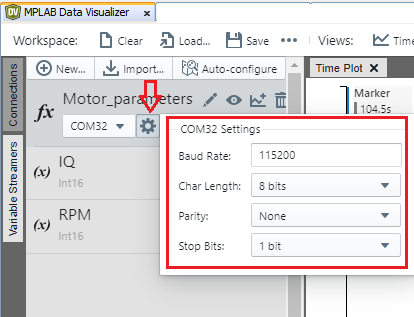

​                      
# DSPIC33CK LVMC development board Data Logger

## Repository Overview
This repository contains firmware for streaming motor IQ and RPM data over UART from the DSPIC33CK LVMC development board. 

## Hardware Used

* dsPIC33CK Low Voltage Motor Control (LVMC) Development Board [(DM330031)](https://www.microchip.com/en-us/development-tool/dm330031)
* 24V 3-Phase Brushless DC Motor [(AC300020)](https://www.microchip.com/en-us/development-tool/ac300020)

## Software Used

* [MPLAB® X IDE](https://microchip.com/mplab/mplab-x-ide)
* [MPLAB® XC16 Compiler](https://microchip.com/mplab/compilers)
* [MPLAB® Code Configurator](https://www.microchip.com/en-us/tools-resources/configure/mplab-code-configurator)

## Related Documentation

* dsPIC33CH512MP508 [Product Family Page](https://www.microchip.com/en-us/product/dspic33ch512mp508)
* motorBench® Development Suite [Software Plugin Details](https://www.microchip.com/en-us/solutions/technologies/motor-control-and-drive/motorbench-development-suite)

# How to Configure, Compile, and Flash
The steps below explain the process of configuring the data logger firmware build, compiling it, and flashing it to the dsPIC33CK device.

1. Plug your  dsPIC33CK Low Voltage Motor Control (LVMC) Development Board into your PC via USB.

2. Install the MPLAB X IDE and XC16 compiler. These are required to load the data logger project and to program the dsPIC33CK board.

3. Open the `ml-33ck256mp508-lvmc-datalogger.X` project folder in MPLAB X.

4. Open  `app_config.h` file located under Header Files. 

5. Select the data streaming format you want by setting the `DATA_STREAMER_FORMAT` macro in `firmware/src/app_config.h` to the appropriate value as summarized in the table below.

   | Streaming Format                                             | app_config.h Configuration Value                          |
   | ------------------------------------------------------------ | --------------------------------------------------------- |
   | ASCII text                                                   | `#define DATA_STREAMER_FORMAT DATA_STREAMER_FORMAT_ASCII` |
   | [MPLAB Data Visualizer](https://www.microchip.com/en-us/development-tools-tools-and-software/embedded-software-center/mplab-data-visualizer) stream | `#define DATA_STREAMER_FORMAT DATA_STREAMER_FORMAT_MDV`   |

6. Modify high-level parameters like sample rate (`SAMPLE_RATE`), number of axes (`NUM_AXES `), and others by changing the macro values defined in `firmware/src/app_config.h`. See the inline comments for further description.

7. Once you're satisfied with your configuration, click the *Make and Program Device* button in the toolbar. 
   |  |
   | :---------------------------------------------------: |
   |               *Make and Program Device*               |

# Firmware Operation
The data streamer firmware will output Motor parameter data over the UART port with the following UART settings:

* Baudrate 115200
* Data bits 8
* Stop bits 1
* Parity None

# Usage with the MPLAB Data Visualizer and Machine Learning Plugins
This project can be used to generate firmware for streaming data to the [MPLAB Data Visualizer plugin](https://www.microchip.com/en-us/development-tools-tools-and-software/embedded-software-center/mplab-data-visualizer) by setting the `DATA_STREAMER_FORMAT` macro to `DATA_STREAMER_FORMAT_MDV` as described above. Once the firmware is flashed, follow the steps below to set up Data Visualizer.

|  |
   | :---------------------------------------------------: |
   |               *Setting macro*               |

1. Connect the dsPIC33CK board to your computer, open up MPLAB X, and open the Data Visualizer plugin.
2. Click the *Load Workspace* button as highlighted in the image below. Select the workspace files included in this repository - located under the `mplab-dv-workspaces` folder. you can always modify the configuration once it is loaded if needed.

|  |
| :-----------------------------------------: |
|        *Loading the workspace file*         |

3. Next, select the Serial/CDC Connection that corresponds to the dsPIC33CK board, and adjust the baud rate to 115200.

|  |
| :------------------------------------------: |
|        *Configuring the serial port*         |

5. In the *Variable Streamers* tab, you can see preloaded variable configurations such as IQ and RPM. You may delete or add variables here if your configuration differs from the pre-loaded ones.

|       |
| :---------------------------------------: |
| *Variable streamer data source selection* |

The  data should now be available in the time plot. Double-click anywhere within the time plot to start/stop scrolling the time axis

|  |
| :---------------------------------: |
|     *Data Visualizer Time Plot*     |

Visit the [Machine Learning Plugin page](https://onlinedocs.microchip.com/oxy/GUID-80D4088D-19D0-41E9-BE8D-7AE3BE021BBF-en-US-3/GUID-E6CBB10A-FFC8-4EF3-8C07-D29B64446EB6.html) to learn more about using the Data Visualizer plugin to export your data for machine learning applications.

